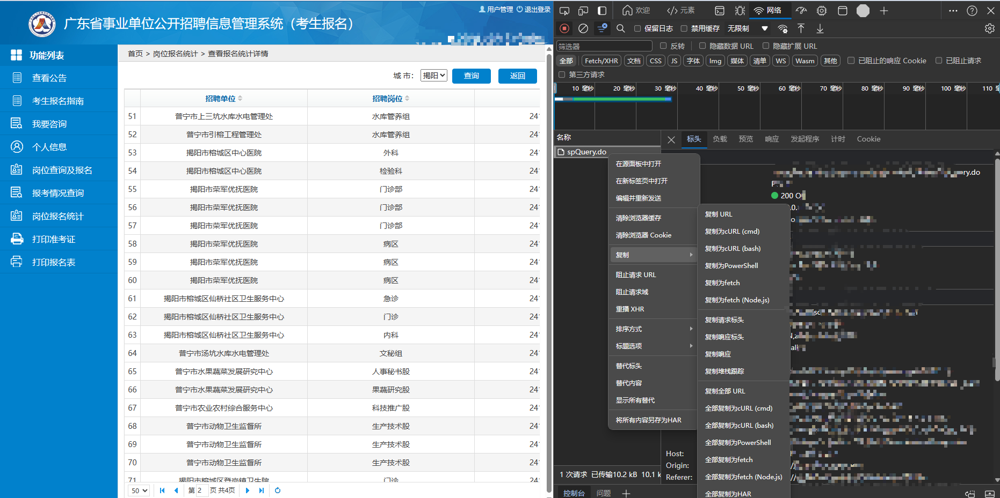

# 获取报名人数
## 1、是什么？
众所周知广东省公务员或事业单位的报名人数查询起来非常麻烦，一次只能搜一个，如果你需要进行多个岗位的对比，那么将会折磨死你。

本项目旨在解决这个问题，通过爬虫技术，自动化地获取广东省事业单位的报名人数，并将结果以柱状图的形式呈现岗位，虽然写的很烂，但是能用就行。

## 2、如何使用？
1. 首先，你需要安装Python环境，并安装好所需的依赖库。
2. 使用pip指令安装必要库，具体用什么库我忘了，反正他提示差什么你就pip install什么。
3. 需要进行个性化修改的代码就是cookies和hender，其中“JSESSIONID”、“../issoYH_MASS_TOKEN”和“Referer”每隔一段时间就需要更新一次，具体的更新方法如下：
   - 首先，登录广东省公务员或事业单位的官网，在浏览器的开发者工具
   - 然后找到以下数据包，此为获取报名情况的请求，没刷出来就点一下下一页就有了 。
   - 拿到数据后自行修改
4. 自行修改为自己的地区，然后找填写自己的目标岗位代码，然后执行代码，等待结果。
5. 结果会以柱状图的形式呈现，其中X轴为岗位，Y轴为报名人数。

## 3、注意事项
1. 还没有，想到再来写。。。